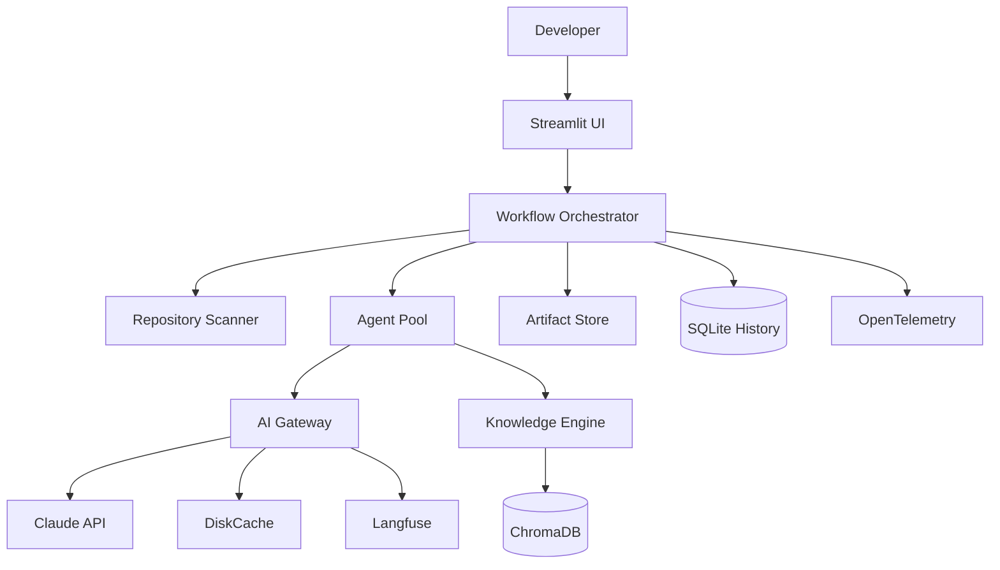
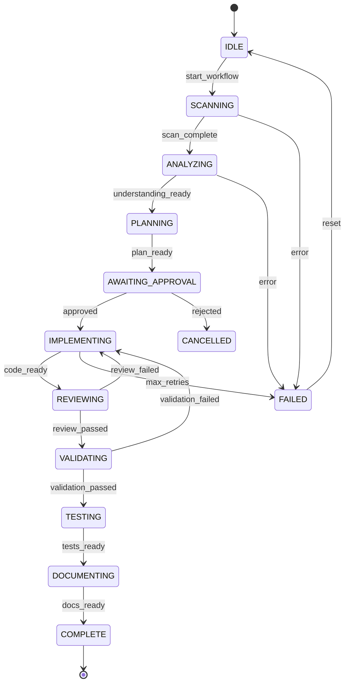
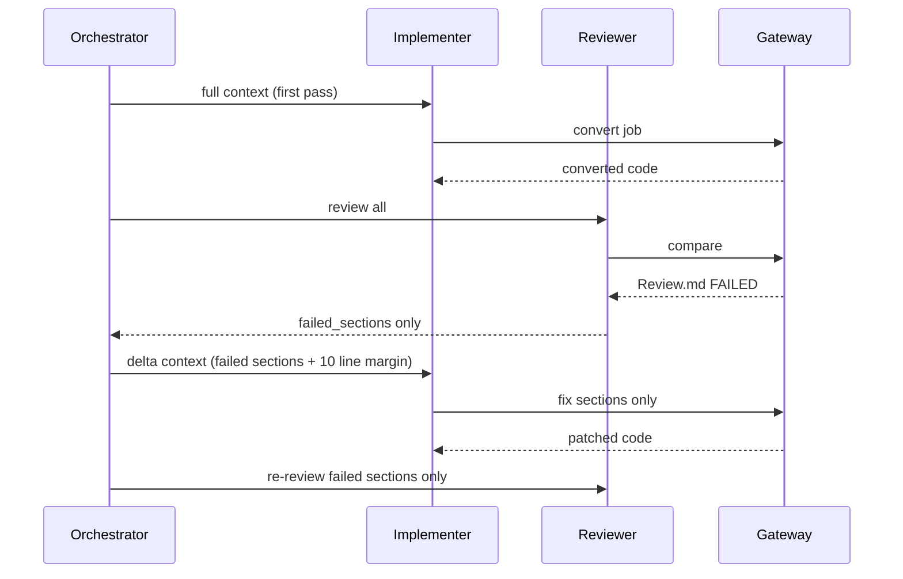

# Architecture

## System Context



## Layered Architecture

| Layer | Components | LLM Access |
|-------|------------|------------|
| Presentation | Streamlit pages, components | No |
| Orchestration | Orchestrator, state machine, events | No |
| Agents | Analyzer, Planner, Implementer, Reviewer, Validator, Tester, Documentation | Via Gateway only |
| Gateway | Prompt builder, cache, token counter, parser | Yes (sole entry) |
| Parser | Scanner, AST extractor, Glue detector | No |
| Knowledge | Embeddings, ChromaDB, retrieval | No |
| Persistence | Artifact store, SQLite, DiskCache | No |

## Communication Rules

```
┌─────────────────────────────────────────────────────────┐
│  RULE 1: Orchestrator → Agent (never Agent → Agent)     │
│  RULE 2: Agent → Gateway → Claude (never direct)        │
│  RULE 3: Artifacts only (MD/JSON/YAML between agents)   │
│  RULE 4: Scanner is deterministic (no LLM)              │
└─────────────────────────────────────────────────────────┘
```

## Orchestrator State Machine



## Data Flow Per Stage

### Stage: SCAN
```
Input:  repo_path | git_url
Output: project.json
LLM:    none
```

### Stage: ANALYZE
```
Input:  job file AST summary + deps from project.json
Output: Understanding.md (v1)
LLM:    1 call (~2-5K tokens)
Cache:  source file hash
```

### Stage: PLAN
```
Input:  Understanding.md
Output: MigrationPlan.md (v1)
LLM:    1 call (~3-6K tokens)
```

### Stage: APPROVE
```
Input:  MigrationPlan.md + cost estimate
Output: approval_record.json
LLM:    none (human)
```

### Stage: IMPLEMENT
```
Input:  Understanding.md + MigrationPlan.md + top-5 knowledge patterns
Output: converted .py, ConversionNotes.md
LLM:    1-3 calls (~5-15K tokens)
```

### Stage: REVIEW
```
Input:  original + understanding + plan + converted
Output: Review.md
LLM:    1 call (~4-8K tokens)
On fail: failed_sections[] only → back to IMPLEMENT
```

### Stage: VALIDATE
```
Input:  all prior artifacts + converted code
Output: Validation.md (score 0-100)
LLM:    1 call (~3-6K tokens)
```

### Stage: TEST
```
Input:  converted code + understanding
Output: TestCases.md + test files
LLM:    1 call (~4-8K tokens)
```

### Stage: DOCUMENT
```
Input:  all artifacts
Output: README.md, Architecture.md, etc.
LLM:    1 call (~3-5K tokens)
```

### Stage: KNOWLEDGE UPDATE
```
Input:  all final artifacts
Output: ChromaDB embeddings + SQLite record
LLM:    none (embedding model only)
```

## Review Loop (Delta Context)



## Component Dependencies

```
frontend → orchestrator → agents → gateway
                       → artifacts
                       → history
                       → parser
agents → knowledge → chromadb
gateway → cache
gateway → langfuse
orchestrator → opentelemetry
```

## Scalability Considerations

| Concern | v1.0 Approach | Future |
|---------|---------------|--------|
| Concurrent jobs | Sequential per project | Celery task queue |
| Large repos | Job-by-job processing | Parallel agent pool |
| Token limits | AST compression + chunking | Hierarchical summarization |
| Storage | Local filesystem + SQLite | Azure Blob + PostgreSQL |

## Security Boundaries

- API keys: `ANTHROPIC_API_KEY` env var only
- Secrets never written to SQLite, logs, or artifacts
- Knowledge DB: optional encryption at rest (v1.0: file permissions)
- Streamlit: localhost bind by default; auth in Phase 8
